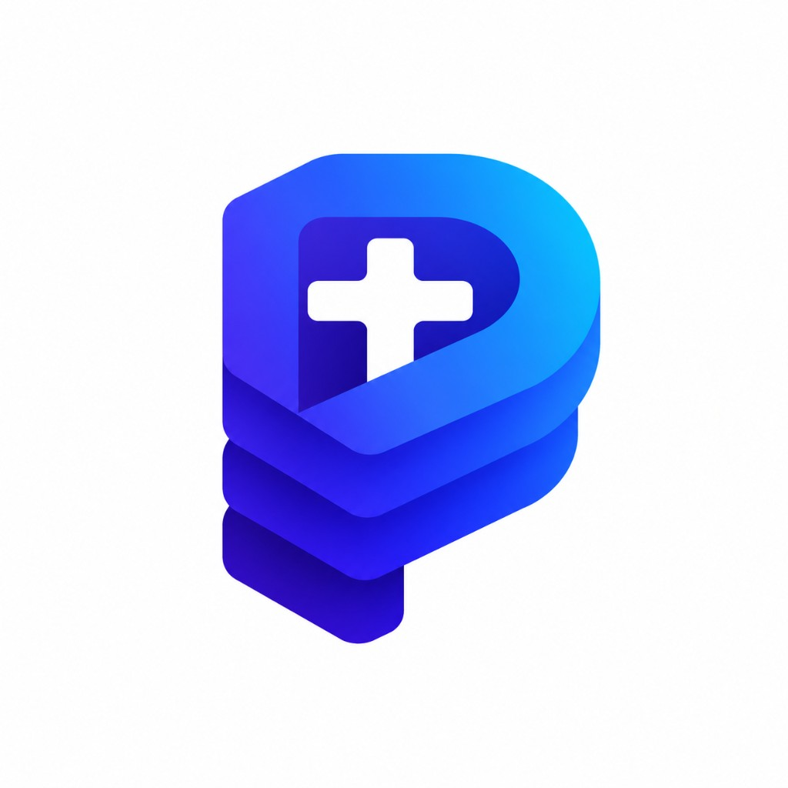
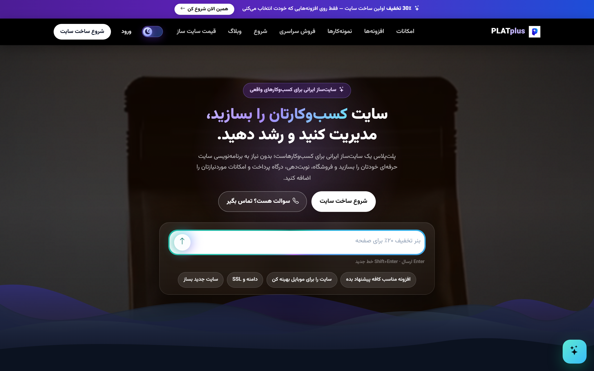
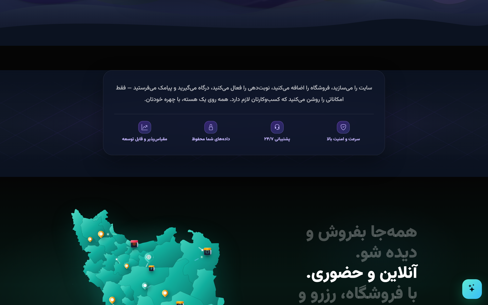
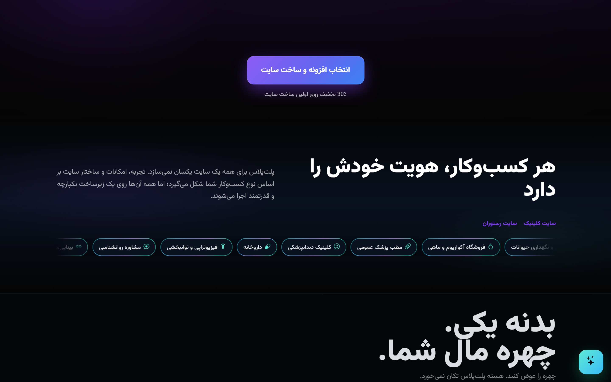

<div align="center">



# PLATplus

### پلتفرم یکپارچهٔ ساخت، فروش و مدیریت کسب‌وکار آنلاین

پلتفرم SaaS چندسایتی با معماری افزونه‌پذیر — از سایت معرفی تا فروشگاه، نوبت‌دهی، آموزش آنلاین، CRM و هوش مصنوعی.

[](https://github.com/Hasanwlip/PLATplus)
[](https://github.com/Hasanwlip/PLATplus)
[](https://github.com/Hasanwlip/PLATplus)
[](https://github.com/Hasanwlip/PLATplus)

<br/>

> این مخزن **فقط هویت و کاتالوگ محصول** است.  
> سورس‌کد، تنظیمات، زیرساخت و داده‌ها منتشر نمی‌شوند.

**وب‌سایت محصول:** [platplus.ir](https://platplus.ir)

</div>

---

## نگاهی به محصول

اسکرین‌شات‌های واقعی از صفحهٔ اصلی [platplus.ir](https://platplus.ir):

### صفحه اصلی — هیرو



### ارزش پیشنهادی و پوشش سراسری



### هویت اختصاصی هر کسب‌وکار



---

## چرا PLATplus؟

PLATplus برای کسب‌وکارهایی ساخته شده که نمی‌خواهند برای هر نیاز یک ابزار جدا بخرند. سایت، فروش، نوبت، پشتیبانی، آموزش، حسابداری و اتوماسیون در یک پنل واحد کنار هم کار می‌کنند — و هر قابلیت فقط وقتی لازم است، به‌صورت افزونه فعال می‌شود.

| | |
|--|--|
| **چندسایتی** | مدیریت چندین سایت مشتری روی یک هسته |
| **افزونه‌پذیر** | بیش از ۶۰ ماژول مستقل با وابستگی هوشمند |
| **پلن‌محور** | استارتر → رشد → فروشگاه → سازمانی |
| **AI-ready** | چت، فروش، رزرو، محتوا و گزارش هوشمند |
| **ایران‌محور** | پرداخت، پیامک، ترب، اسنپ‌پی، مودیان، نت‌ملی |

---

## هستهٔ پلتفرم

همیشه فعال — بدون خرید جداگانه:

- **صفحات سایت** — خانه، درباره، خدمات، تماس و صفحه‌ساز
- **دستیار مالک** — مدیریت پنل با گفت‌وگوی فارسی (رایگان)
- **گالری** — ویترین تصاویر و نمونه‌کار
- **فرم‌ساز** — فرم استخدام، مشاوره، پذیرش، شکایت و سفارشی
- **آمار سایت** — بازدید، منابع ورودی، KPI و قیف تبدیل
- **FAQ سایت** — پاسخ سوالات پرتکرار قبل از تماس
- **پرداخت و پیامک** — درگاه + OTP + اعلان سفارش/نوبت
- **نت ملی** — CDN و فونت داخلی بدون وابستگی خارجی
- **PWA پایه** — نصب سایت مثل اپ روی موبایل
- **تم‌ها** — پت‌شاپ، کلینیک، مدرن

---

## پلن‌ها

| پلن | مناسب برای | تمرکز |
|-----|-----------|--------|
| **استارتر** | معرفی آنلاین کسب‌وکار | سایت، گالری، فرم، آمار، ظاهر |
| **رشد** | کلینیک، سالن، خدمات حضوری | بلاگ، نوبت، کارکنان، هلپ، تیکت، اتوماسیون |
| **فروشگاه** | فروش آنلاین و محلی | فروشگاه، مراقبت، منوی کافه، دامنه اختصاصی |
| **سازمانی** | چند شعبه و برند بزرگ | سفارشی‌سازی، SLA، white-label |

### امکانات هر پلن

<details>
<summary><b>استارتر</b> — معرفی حرفه‌ای</summary>

- صفحات لندینگ (خانه، خدمات، تماس، درباره)
- سوالات متداول سایت
- گالری تصاویر
- فرم تماس و پیام‌های مشتری
- فرم‌ساز (تا ۳ فرم)
- آمار سایت (۷ روز)
- تنظیم ظاهر و رنگ‌بندی
- تم‌های صنفی
- PWA پایه + نت ملی
- درگاه پرداخت و پیامک
- سئو پایه صفحات

</details>

<details>
<summary><b>رشد</b> — کسب‌وکار خدماتی</summary>

- همه امکانات استارتر
- بلاگ و مقالات
- هلپ سنتر و تیکت پشتیبانی
- کاتالوگ خدمات (قیمت، FAQ، اتصال نوبت)
- کارکنان (شیفت، مرخصی، پورسانت)
- اتوماسیون هوشمند
- فرم‌ساز نامحدود
- آمار کامل (۹۰ روز + منابع ورودی)
- دامنه اختصاصی (با پیکربندی)
- مسیر خرید افزونه‌های نوبت حرفه‌ای، AI، PWA و سئو

</details>

<details>
<summary><b>فروشگاه</b> — تجارت آنلاین</summary>

- همه امکانات رشد
- فروشگاه کامل (محصول، سفارش، ارسال)
- مراقبت و داروخانه
- منوی دیجیتال کافه / رستوران
- دامنه اختصاصی
- مسیر خرید افزونه‌های انبار، کیف پول، مارکت‌پلیس، باشگاه و AI فروش

</details>

<details>
<summary><b>سازمانی</b> — مقیاس بالا</summary>

- همه امکانات فروشگاه
- چند شعبه و سفارشی‌سازی
- API و یکپارچه‌سازی
- White-label / برند اختصاصی
- SLA و پشتیبانی اختصاصی
- مشاوره استقرار و آموزش تیم

</details>

---

## کاتالوگ کامل قابلیت‌ها

### ۱) محتوا و حضور آنلاین

| قابلیت | توضیح |
|--------|--------|
| **بلاگ** | انتشار مقاله، دسته‌بندی، پیش‌نویس و پایهٔ تولید محتوای AI |
| **هلپ سنتر** | مرکز راهنما با دسته، مقاله و جستجو |
| **تیکت پشتیبانی** | صندوق پیگیری‌دار با کد پیگیری |
| **سئو پیشرفته** | متا، OG، Schema، اسکن سلامت، Sitemap/Robots |
| **چندزبانه** | نمایش و مدیریت محتوای چندزبانه |
| **گالری** | ویترین تصاویر و نمونه‌کار |

### ۲) نوبت‌دهی و خدمات

| قابلیت | توضیح |
|--------|--------|
| **نوبت‌دهی** | رزرو آنلاین خدمت، تقویم وضعیت، ظرفیت و قیمت |
| **کارکنان** | پروفایل نیرو، شیفت، مرخصی، پورسانت |
| **نوبت‌دهی حرفه‌ای** | چند متخصص، پیش‌پرداخت، یادآوری SMS، پکیج خدمت |
| **کاتالوگ خدمات** | صفحه خدمت با قیمت، مدت، FAQ و اتصال به نوبت |
| **جلسه سرویس‌دهنده** | اتاق خصوصی چت/ویس/ویدیو متصل به رزرو |
| **منشی هوشمند** | Case / Approval / Job برای عملیات روزمره |

### ۳) فروشگاه و تجارت

| قابلیت | توضیح |
|--------|--------|
| **فروشگاه** | محصول، سبد، تسویه، سفارش، نظر و اطلاع موجودشدن |
| **مراقبت و داروخانه** | ویترین تخصصی محصولات مراقبتی |
| **منوی دیجیتال** | منوی کافه/رستوران با مواد، آلرژن و سفارش آنلاین |
| **انبارداری** | موجودی، کسر خودکار، هشدار کمبود، لاگ و ارزش انبار |
| **ورود مشتری** | ورود OTP و حساب کاربری |
| **کیف پول** | شارژ، کسر و پرداخت از موجودی مشتری |
| **کد تخفیف** | کوپن و کمپین تخفیف |
| **FAQ محصول** | سوالات متداول روی صفحه محصول |
| **علاقه‌مندی** | Wishlist و هشدار کاهش قیمت |
| **ارسال هوشمند** | پست / تیپاکس و رهگیری |
| **کارت‌به‌کارت** | دریافت و تأیید رسید کارت به کارت |
| **درگاه کریپتو** | پرداخت رمزارزی |
| **اسنپ‌پی** | خرید اقساطی |
| **ترب** | اتصال کاتالوگ به ترب |
| **نرخ زنده (TGJU)** | قیمت‌گذاری هوشمند با نرخ روز |
| **عمده‌فروشی** | فروش B2B روی همان فروشگاه |
| **مارکت‌پلیس غرفه‌ای** | چند غرفه‌دار، کمیسیون و تسویه |
| **باشگاه مشتریان** | وفاداری و امتیاز |
| **کارت هدیه** | گیفت‌کارت |
| **بونوس و مشوق** | مشوق خرید و کمپین تشویقی |
| **اشتراک مشتری** | عضویت و اشتراک دوره‌ای |
| **فاکتور رسمی / مودیان** | صدور فاکتور رسمی |
| **حسابداری** | درآمد، هزینه، دفتر کل و کدینگ |

### ۴) هوش مصنوعی

| قابلیت | کاربرد |
|--------|--------|
| **تولید متن (AI)** | متن خدمات و محتوای پنل |
| **کپشن (AI)** | کپشن شبکه و بنر |
| **FAQ هوشمند** | تولید سوالات متداول |
| **چت‌بات** | پاسخ‌گویی خودکار به مشتری |
| **تولید مقاله** | ایده‌پردازی و نگارش بلاگ |
| **کمپین‌ساز** | ساخت و نمایش کمپین |
| **دستیار رزرو** | رزرو گفت‌وگویی با انتخاب اسلات |
| **دستیار فروش** | پیشنهاد محصول، لینک پرداخت، handoff به اپراتور |
| **مشاوره پولی در چت** | مشاوره پولی داخل گفتگو |
| **گزارش هوشمند** | بینش فروش و عملکرد |

### ۵) آموزش آنلاین (LMS)

| قابلیت | توضیح |
|--------|--------|
| **آموزش آنلاین** | دوره، ثبت‌نام، فروش، پیشرفت، مسیر یادگیری |
| **ویدئوی آموزشی** | استریم امن و پلیر محافظت‌شده |
| **آزمون آنلاین** | موتور آزمون و بانک سوال |
| **نظارت آزمون (Proctor)** | ضدتقلب و نظارت هوشمند |
| **گواهینامه** | طراحی گواهی، PDF و استعلام |

### ۶) عملیات، چاپ و حضور

| قابلیت | توضیح |
|--------|--------|
| **عملیات خودرو** | کارت کار، پذیرش پلاک، خطوط خدمت |
| **فرم‌های چاپی** | PDF برند و پر کردن از داده خودرو |
| **هاب چاپگر** | دستگاه، مسیر چاپ، ESC/POS و چاپ محلی |
| **قراردادساز** | قرارداد، امضا و PDF |
| **PDFساز** | جزوه و گزارش برند |
| **دوربین زنده** | عملیات زنده بدون باز کردن پورت DVR |
| **حضور و غیاب** | ثبت اثرانگشت و حضور کارکنان |

### ۷) ایونت، ارتباط و اتوماسیون

| قابلیت | توضیح |
|--------|--------|
| **ایونت و مراسم** | رویداد، ثبت‌نام و فروش بلیت |
| **دعوتنامه دیجیتال** | دعوت با توکن و RSVP |
| **جلسه ویدیویی** | اتاق WebRTC با کد ورود، چت و مدیریت مهمان |
| **CRM و قیف فروش** | کانبان، تماس، معامله و فعالیت |
| **اتوماسیون** | Trigger → Condition → Action (SMS، ایمیل، تلگرام، واتساپ، webhook و بیشتر) |
| **PWA پیشرفته** | پوش نوتیفیکیشن و کمپین موبایلی |

---

## معماری محصول

```text
┌──────────────────────────────────────────────┐
│                 PLATplus Core                │
│   Auth · Billing · Plans · Domains · API     │
├──────────────┬───────────────┬───────────────┤
│  Site Engine │ Plugin System │ Owner Panel   │
│  Themes/CMS  │ 60+ modules   │ Assistant AI  │
├──────────────┼───────────────┼───────────────┤
│   Commerce   │   Booking     │   Education   │
│ Shop/Menu/MP │ Staff/Pro     │ LMS/Quiz/Cert │
├──────────────┼───────────────┼───────────────┤
│     CRM      │  Automation   │   Payments    │
│ Pipeline     │ Events/Jobs   │ Gateways/SMS  │
└──────────────┴───────────────┴───────────────┘
```

- **Multi-tenant:** چند سایت روی یک هسته
- **Plugin lifecycle:** نصب، فعال‌سازی، ارتقا، غیرفعال‌سازی
- **Plan gate:** دسترسی بر اساس پلن + لایسنس افزونه
- **Domain events:** رویدادهای دامنه برای اتوماسیون و یکپارچگی

---

## برای چه کسب‌وکارهایی؟

| حوزه | ترکیب پیشنهادی |
|------|----------------|
| کلینیک / سالن | نوبت + کارکنان + خدمات + منشی |
| فروشگاه محلی | فروشگاه + انبار + ارسال + کیف پول |
| کافه / رستوران | منوی دیجیتال + سفارش + چاپ |
| آموزشگاه | LMS + آزمون + گواهی + ویدیو |
| پت‌شاپ / کلینیک حیوانات | فروشگاه + مراقبت + نوبت |
| مارکت چندفروشنده | مارکت‌پلیس + کمیسیون + تسویه |
| خدمات خودرو | عملیات + فرم چاپی + دوربین + چاپگر |

---

## فناوری‌ها

| لایه | فناوری |
|------|--------|
| Backend | PHP 8.1+ |
| Database | MySQL |
| Frontend | HTML5 · CSS3 · JavaScript |
| معماری | Multi-tenant · Plugin-based · Event-driven |
| تجربه موبایل | PWA · Web Push |
| خروجی | PDF · QR · چاپ ESC/POS |
| یکپارچه‌سازی | درگاه پرداخت · پیامک · ترب · اسنپ‌پی · مودیان |

---

## وضعیت پروژه

پروژه در **توسعه فعال** است. کاتالوگ قابلیت‌ها با محصول واقعی هم‌تراز نگه داشته می‌شود؛ جزئیات پیاده‌سازی و سورس خصوصی می‌مانند.

---

## مالک پروژه

طراحی، توسعه و نگهداری توسط **[@Hasanwlip](https://github.com/Hasanwlip)**

---

## مالکیت معنوی

این پروژه نرم‌افزار اختصاصی (Proprietary) است.

- سورس‌کد در این مخزن وجود ندارد
- هیچ مجوزی برای استفاده، کپی، تغییر یا توزیع کد اعطا نمی‌شود
- نام، برند و کاتالوگ محصول متعلق به مالک پروژه است

---

<div align="center">

**Source code is private and is not included in this repository.**

</div>
